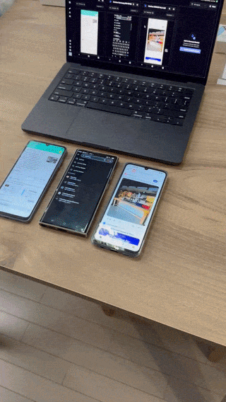
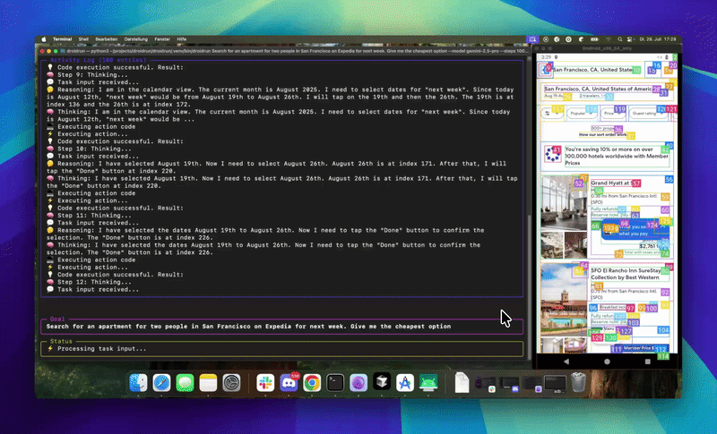
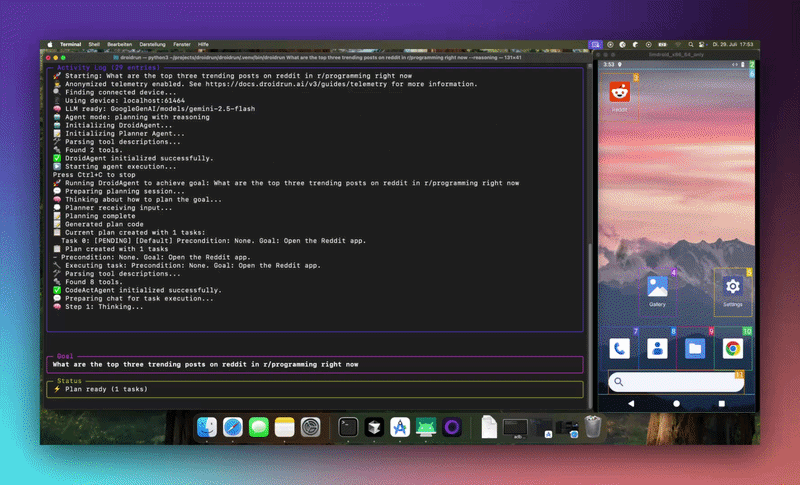
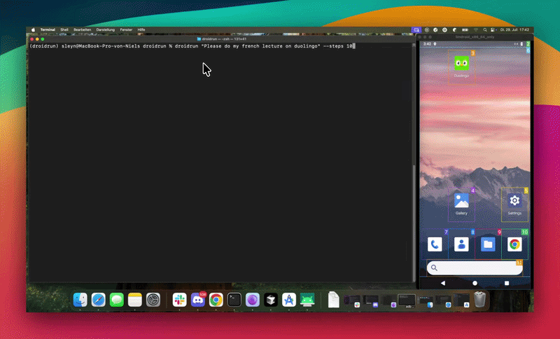

# mobilerun-custom

> **This is a modified copy of [Mobilerun](https://github.com/droidrun/mobilerun) by [droidrun](https://github.com/droidrun).**
> All credit for the framework goes to the original authors. It is based on upstream commit
> [`e72c1d2`](https://github.com/droidrun/mobilerun/commit/e72c1d2) (June 24, 2026, package version 0.6.8)
> and is distributed under the original [MIT License](LICENSE).
> For installation, usage, and full documentation, see the original README below and [docs.mobilerun.ai](https://docs.mobilerun.ai).

This fork adds reliability fixes for running the Android agent with self-hosted and local LLMs. The changes came out of benchmarking mobilerun against Mobile-Agent-v3.5 (`mobile_use`). The full write-up is in [`report.md`](report.md).

## Changes from upstream

### Agent behaviour: `mobilerun/agent/fast_agent/fast_agent.py`
- **Stuck-loop detection.** If the agent issues the same tool call 3 times in a row, it gets a "LOOP DETECTED" message with alternative strategies: try a different element, tap by coordinates, open the item instead of scrolling, or press Back.
- **Alternating-loop detection.** A 6-step sliding window catches A/B/A/B patterns (such as click/swipe/click/swipe) that the 3-in-a-row check misses.
- **Vision escalation on loops.** When a loop is detected, a fresh screenshot goes to the model on the next step even if vision is off.
- **Step-budget reminder.** Each turn includes a `<step_budget>` note with the current step and the steps remaining, so the model stays goal-focused near the limit.

### XML tool-call parsing: `mobilerun/agent/fast_agent/xml_parser.py`
- Accepts `<parameter foo>` as well as `<parameter name="foo">`, because Nemotron and some other local models use the shorter form.
- Strips surrounding whitespace from parameter values.

### System prompt: `mobilerun/config/prompts/fast_agent/system.jinja2`
- **Browser choice.** The agent prefers Chrome and the YouTube app over Samsung Internet, which plays YouTube inline and blocks the accessibility tree.
- **Gmail outbox counts as success.** "Sending…", "Outbox" or "No connection" after Send is treated as a completed send. This stops retries that open a blank compose window and create duplicate emails.

### LLM providers
- **Nvidia NIM** is added as a provider. It uses the OpenAI-compatible endpoint `https://integrate.api.nvidia.com/v1` and reads the `NVIDIA_API_KEY` environment variable. Files: `mobilerun/agent/providers/registry.py`, `mobilerun/agent/utils/llm_picker.py`, `mobilerun/config_manager/env_keys.py`.
- **OpenRouter** now reads `OPENROUTER_API_KEY` from the environment when no key is passed.

### Security / repository hygiene
- `mobilerun/agent/utils/oauth/gemini_oauth_code_assist_llm.py`: the Gemini (Antigravity) OAuth client ID and secret are no longer hard-coded. They're read from `GEMINI_OAUTH_CLIENT_ID` and `GEMINI_OAUTH_CLIENT_SECRET`; see [`.env.example`](.env.example).
- `.gitignore` now also excludes `.env` files, key and certificate files, and `.DS_Store`.

### Additions
- [`report.md`](report.md) is a comparative benchmark report (mobilerun + Qwen3.6-27B vs mobile_use + GUI-Owl-32B), prepared by Abdelrahman Awagih.

### Benchmark run configuration (not part of this repository's code)
The report also describes settings used during the benchmark runs: always-on vision (screenshot and accessibility tree every step), `parallel_tools: false`, 40 max steps, human-like typing delays and `show_touches`. These were local configuration and runtime settings. They aren't included here as code changes.

## Environment variables

| Variable | Used for |
|---|---|
| `NVIDIA_API_KEY` | Nvidia NIM provider |
| `OPENROUTER_API_KEY` | OpenRouter provider |
| `GEMINI_OAUTH_CLIENT_ID`, `GEMINI_OAUTH_CLIENT_SECRET` | Gemini OAuth login (optional) |

---

## Original README

<picture align="center">
  <source media="(prefers-color-scheme: dark)" srcset="./static/mobilerun-dark.png">
  <source media="(prefers-color-scheme: light)" srcset="./static/mobilerun.png">
  
</picture>

<p align="center">
  <strong>Mobilerun is an open-source framework for controlling Android and iOS devices with LLM agents.</strong><br>
  It gives agents mobile-native tools to inspect UI state, understand screenshots, tap, swipe, type, plan multi-step workflows, and return results through a CLI or Python API.
</p>

<div align="center">

<a href="https://docs.mobilerun.ai">📕 Documentation</a>
·
<a href="https://cloud.mobilerun.ai">☁️ Mobilerun Cloud</a>

[](https://github.com/droidrun/mobilerun/stargazers)
[](https://mobilerun.ai)
[](https://x.com/mobilerun_ai)
[](https://discord.gg/ZZbKEZZkwK)
[](https://mobilerun.ai/benchmark)


<picture>
  <source media="(prefers-color-scheme: dark)" srcset="https://api.producthunt.com/widgets/embed-image/v1/top-post-badge.svg?post_id=983810&theme=dark&period=daily&t=1753948032207">
  <source media="(prefers-color-scheme: light)" srcset="https://api.producthunt.com/widgets/embed-image/v1/top-post-badge.svg?post_id=983810&theme=neutral&period=daily&t=1753948125523">
  <a href="https://www.producthunt.com/products/droidrun-framework-for-mobile-agent?embed=true&utm_source=badge-top-post-badge&utm_medium=badge&utm_source=badge-droidrun" target="_blank"></a>
</picture>


[Deutsch](https://zdoc.app/de/droidrun/mobilerun) | 
[Español](https://zdoc.app/es/droidrun/mobilerun) | 
[français](https://zdoc.app/fr/droidrun/mobilerun) | 
[日本語](https://zdoc.app/ja/droidrun/mobilerun) | 
[한국어](https://zdoc.app/ko/droidrun/mobilerun) | 
[Português](https://zdoc.app/pt/droidrun/mobilerun) | 
[Русский](https://zdoc.app/ru/droidrun/mobilerun) | 
[中文](https://zdoc.app/zh/droidrun/mobilerun)

</div>


<p align="center">
  
</p>

- 🤖 Control Android and iOS devices with natural language commands
- 🔀 Use OpenAI, Anthropic, Gemini, Ollama, DeepSeek, OpenRouter, and OpenAI-compatible models
- 🧠 Run direct tasks or enable reasoning mode for complex multi-step automation
- 💻 Automate from the CLI, a terminal UI, Docker, or Python code
- 🐍 Extend agents with custom tools, structured output, app cards, and credentials
- 📸 Combine accessibility trees with screenshots for visual understanding
- 🫆 Trace execution with Arize Phoenix or Langfuse

Use the framework when you want to run the agent on your machine. Use [Mobilerun Cloud](https://cloud.mobilerun.ai) when you want a ready-to-go solution for your local phones or cloud-hosted virtual/physical phones, managed infrastructure, and API-driven device workflows without running the agent on your local machine. [Check out our benchmark results](https://mobilerun.ai/benchmark).

## 📦 Installation

> **Note:** Python 3.14 is not currently supported. Please use Python `>=3.11,<3.14`.

Install Mobilerun with [`uv`](https://docs.astral.sh/uv/):

```bash
# CLI usage
uv tool install mobilerun
```

```bash
# CLI + Python integration
uv pip install mobilerun
```

Most LLM providers are included by default. For Anthropic support, install the optional extra:

```bash
uv tool install "mobilerun[anthropic]"
```

## 🚀 Quickstart

```bash
uv tool install mobilerun
mobilerun setup
mobilerun configure
mobilerun run "Open settings and turn on dark mode"
```

Before starting, make sure you have [ADB](https://developer.android.com/studio/releases/platform-tools) installed and an Android device with Developer options and USB debugging enabled. iOS setup is supported separately through the iOS Portal flow.

### 1. Install the Portal on your device

```bash
mobilerun setup
```

This installs the Mobilerun Portal app, enables its accessibility service, and prepares the device for local control.

### 2. Verify the connection

```bash
mobilerun ping
```

You should see confirmation that the Portal is installed and accessible.

### 3. Configure your LLM provider

```bash
mobilerun configure
```

The wizard walks you through choosing a provider, auth method, and model. You can also use provider environment variables such as `GOOGLE_API_KEY`, `OPENAI_API_KEY`, or `ANTHROPIC_API_KEY`.

### 4. Run your first command

```bash
mobilerun run "Open the settings app and tell me the Android version"
```

Useful run options:

```bash
mobilerun run "Open settings and turn on dark mode"
mobilerun run "What app is currently open?" --vision
mobilerun run "Find a contact named John and send him an email" --reasoning
mobilerun run "Take a screenshot" --ios
mobilerun run "Open Settings" --steps 30 --debug
```

Read the full [framework documentation](https://docs.mobilerun.ai/framework/quickstart).

[](https://www.youtube.com/watch?v=4WT7FXJah2I)

## ⚙️ Features

- **CLI:** Run one-off natural language tasks, inspect devices, replay macros, and debug from the terminal.
- **Python API:** Build custom mobile automation workflows with Python and use custom tools.
- **Android and iOS support:** Control Android through the Portal app or target iOS through the iOS Portal flow.
- **Portal-based control:** Use UI trees, screenshots, text input, gestures, app launching, and device state from the Portal runtime.
- **Vision mode:** Send screenshots to the LLM with `--vision`, or use screenshot-only control with `--vision-only` (useful for the apps that do not have a11y tree information).
- **Reasoning mode:** Use `--reasoning` for manager-executor planning on longer or more complex tasks.
- **Tracing and telemetry:** Debug execution with Arize Phoenix, Langfuse, saved trajectories, and detailed logs.
- **Structured output:** Return structured data from mobile workflows.
- **App cards and custom tools:** Add app-specific guidance to make agent perform better on your use-cases.
- **Docker:** Run Mobilerun in a container for repeatable local environments.

## ☁️ Framework vs Cloud

| | Mobilerun Framework | Mobilerun Cloud |
| --- | --- | --- |
| Best for | Running agents locally on your own machine and devices | Ready-to-go local phone control, hosted real or virtual devices, API workflows, and managed device operations |
| Runtime | Your machine  | Mobilerun-managed infrastructure |
| Interface | CLI, Docker, and Python API | Dashboard, REST API, SDKs, and hosted devices |

Use the framework when you want full local control of the agent runtime. Use [Mobilerun Cloud](https://cloud.mobilerun.ai) when you want managed devices, fleet workflows, or cloud APIs without running the agent locally. Learn more in the [framework overview](https://docs.mobilerun.ai/framework/overview) and the [cloud docs](https://docs.mobilerun.ai).

### Which should I choose?

- Choose **Mobilerun Framework** for local agent execution and code-level control.
- Choose **Mobilerun Cloud** for managed phones, APIs, and scale without running agents locally.

### Cloud Device Types

| Device type | What it is | Best for |
| --- | --- | --- |
| Personal | Your own hardware connected to Mobilerun Cloud | Quick automation on devices you own |
| Cloud Phone (Hosted) | Instantly available cloud-hosted phone | Scalable hosted automation |
| Physical Phone (Hosted) | Real hardware with stronger identity characteristics | Workflows that need high device authenticity and trust |

## 🎬 Demo Videos

### Book accommodation from a prompt

Shows multi-step navigation, text input, and app-state reasoning while Mobilerun searches for accommodation.

<a href="https://youtu.be/VUpCyq1PSXw">
  
</a>

### Find trending content

Shows browsing, app navigation, and result extraction from a natural-language task.

<a href="https://youtu.be/7V8S2f8PnkQ">
  
</a>

### Maintain an app streak

Shows a short recurring mobile workflow that can be automated from a prompt.

<a href="https://youtu.be/B5q2B467HKw">
  
</a>

## 💡 Example Use Cases

- Mobile app QA and regression testing
- Guided workflows for non-technical users
- Repetitive task automation on mobile devices
- Event-driven automation from schedules, notifications, or custom triggers
- Data extraction from native mobile apps
- Running automations on multiple devices at once

## 📚 Documentation

- [Framework quickstart](https://docs.mobilerun.ai/framework/quickstart)
- [Mobilerun cloud quickstart](https://docs.mobilerun.ai/quickstart)
- [Device setup](https://docs.mobilerun.ai/framework/guides/device-setup)
- [CLI guide](https://docs.mobilerun.ai/framework/guides/cli)
- [SDK reference](https://docs.mobilerun.ai/framework/sdk/reference)
- [Custom tools](https://docs.mobilerun.ai/framework/features/custom-tools)
- [Agent architecture](https://docs.mobilerun.ai/framework/concepts/architecture)
- [Structured output](https://docs.mobilerun.ai/framework/features/structured-output)
- [Tracing](https://docs.mobilerun.ai/framework/features/tracing)

## 👥 Contributing

Contributions are welcome. Please feel free to submit a pull request or open an issue.

## 📄 License

This project is licensed under the MIT License. See [LICENSE](./LICENSE) for details.

## Security Checks

To help catch security issues before submitting changes, run:

```bash
bandit -r mobilerun
safety scan
```
